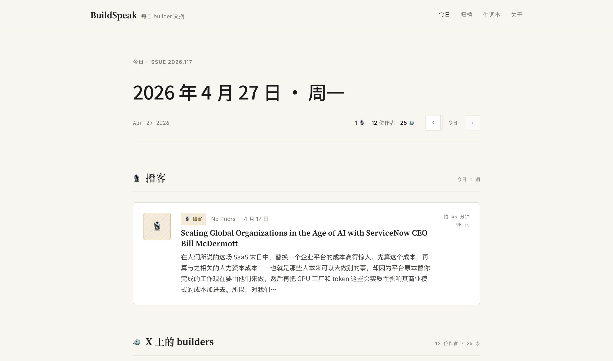
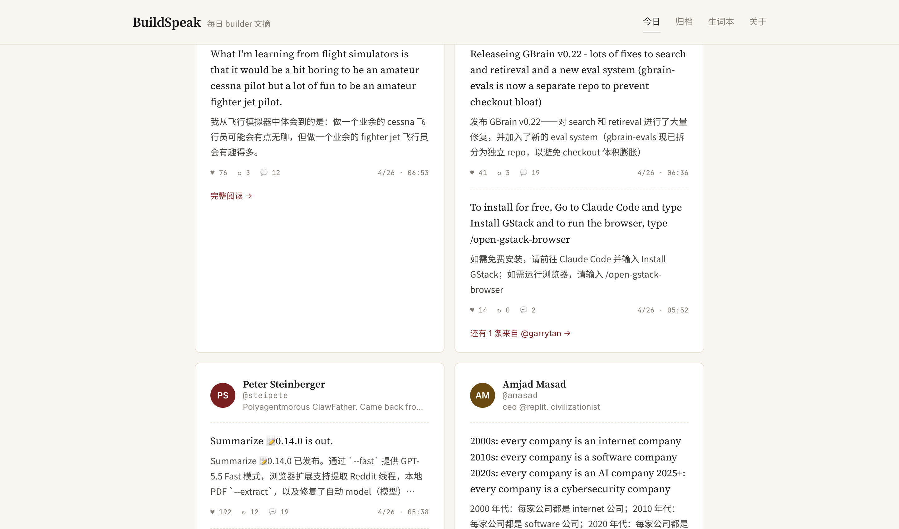
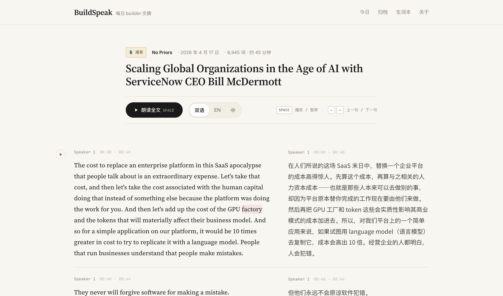
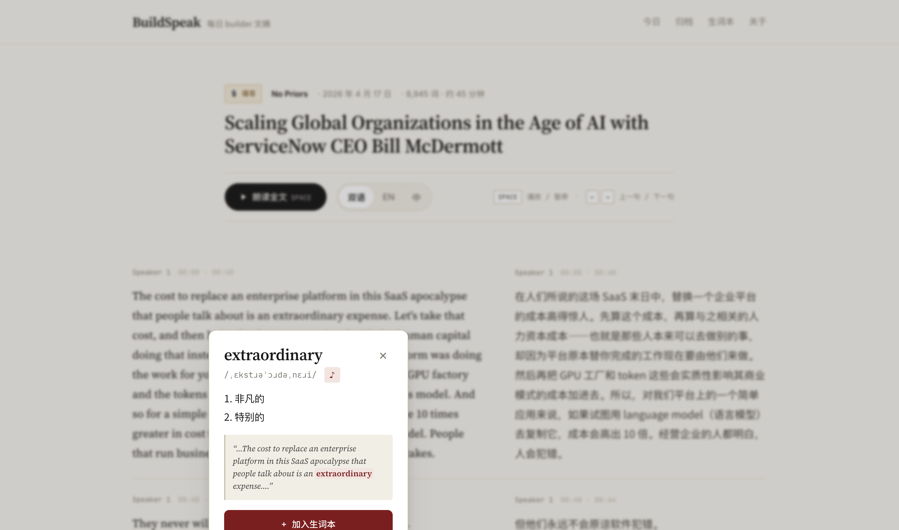
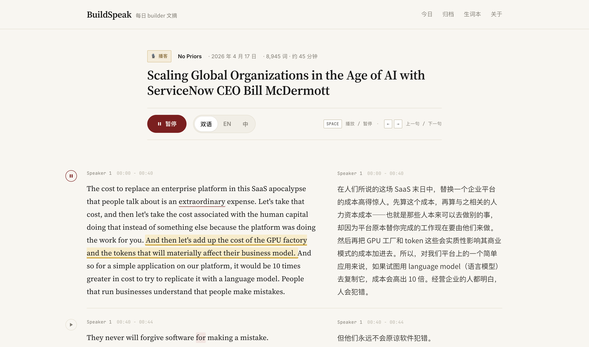
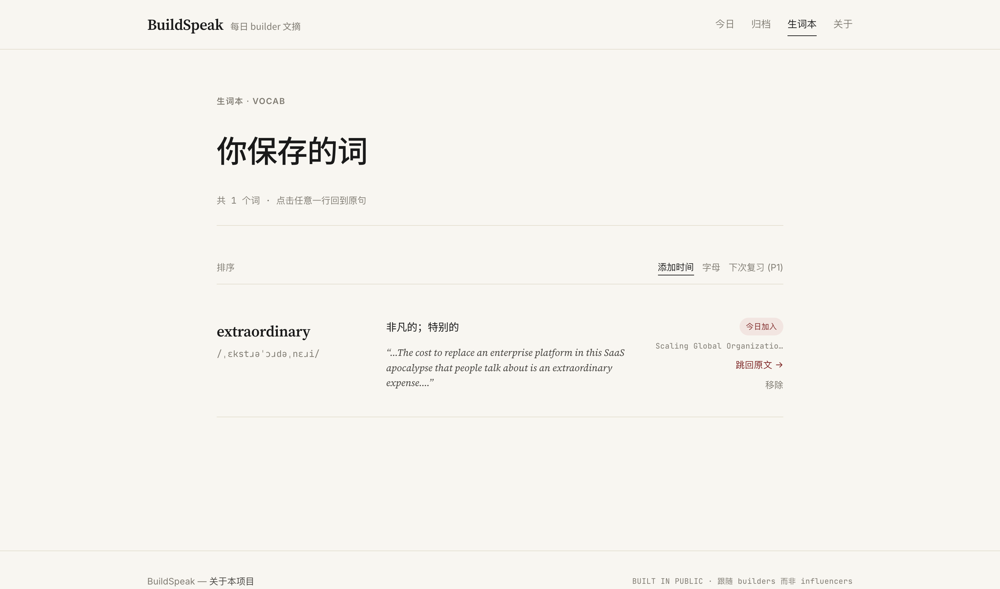
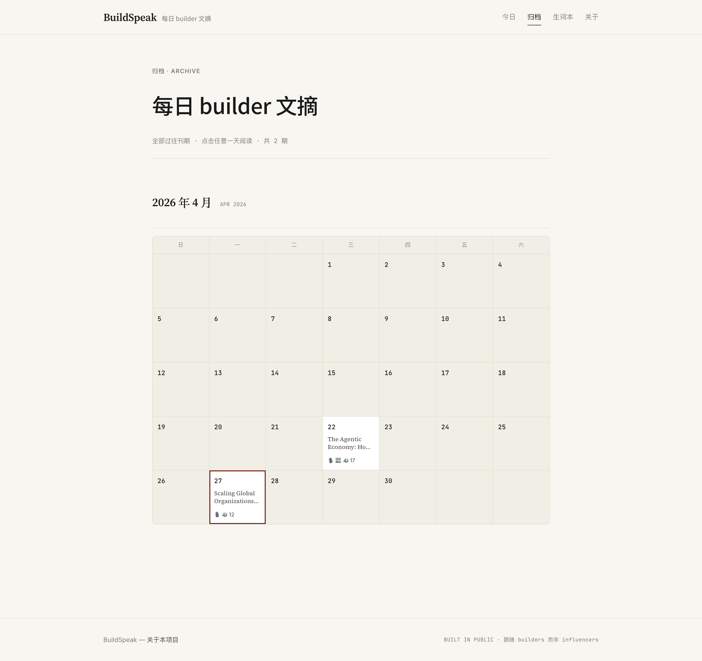

**English** | [中文](README.zh-CN.md)

# BuildSpeak

> Daily reading from the people actually building AI — bilingual, with a
> word-tap dictionary for English learners.

[**buildspeak.ryderlab.work**](https://buildspeak.ryderlab.work) — live demo

BuildSpeak is a daily web reader for AI builder content. Every day at 06:00 UTC,
a GitHub Actions cron pulls fresh tweets, podcasts and blog posts from a curated
list of ~25 AI builders + ~6 podcasts + ~2 official AI company blogs (sourced
from [follow-builders](https://github.com/zarazhangrui/follow-builders)),
translates each paragraph into Chinese with a build-time LLM call, and ships
the result as a static Next.js site.

The audience is the Chinese-native, English-second tech professional who would
otherwise be reading these feeds anyway — bilingual layout, sentence-level TTS
playback, and tap-any-word definitions are an English-learning bonus, not the
core promise.

---

## Product tour

Screenshots from the live site:

| Today's issue | Builder feed |
| --- | --- |
|  |  |

| Bilingual reader | Word lookup |
| --- | --- |
|  |  |

| TTS highlighting | Vocab list |
| --- | --- |
|  |  |

| Archive calendar |
| --- |
|  |

---

## What you get on the site

- **Today's issue** — one podcast, one blog (when present), and 10–17 builders'
  fresh tweets, grouped by source.
- **Bilingual reader** — full paragraphs side-by-side English / Chinese,
  toggleable to either alone.
- **Sentence-level TTS** — Web Speech API, with the active sentence highlighted
  while it plays. Space to play/pause, ←/→ to skip sentences.
- **Tap any word** — popover with IPA, Chinese gloss(es), context sentence,
  pronounce button, and "save to vocab".
- **Vocab list** — every saved word, with a link back to the paragraph it came
  from. localStorage only, no server account.
- **Archive** — calendar view of every past issue. Each populated day links to
  its full digest.
- **Builder profile** — `/b/<handle>` aggregates everything one builder said,
  newest first, with TTS for the full timeline.

---

## How it works

```
┌────────────────────────────────────────────────────────────────────┐
│  follow-builders (upstream)                                        │
│  Daily fetches X / YouTube transcripts / blog posts → 3 JSON feeds │
│  on github.com/zarazhangrui/follow-builders/main                   │
└──────────────────────────────────┬─────────────────────────────────┘
                                   │ raw.githubusercontent.com
                                   ▼
┌────────────────────────────────────────────────────────────────────┐
│  GitHub Actions cron — 06:00 UTC daily                             │
│   1. pnpm fetch-feed → composes digest-YYYYMMDD.json               │
│   2. pnpm pipeline → 5 stages:                                     │
│        parse → translate → tokenize → enrich → emit                │
│        (LLM translates new paragraphs; cache reuses old ones)      │
│   3. git commit content/* + push                                   │
└──────────────────────────────────┬─────────────────────────────────┘
                                   │ push
                                   ▼
┌────────────────────────────────────────────────────────────────────┐
│  Vercel — Next.js 16 static build                                  │
│    Reads apps/web/content/*.json, prerenders ~60 pages,            │
│    serves from edge CDN                                            │
└────────────────────────────────────────────────────────────────────┘
```

Every paragraph translation is keyed by content hash, so the second day's run
only translates new paragraphs (typically a few dozen). After the first run,
daily LLM cost is on the order of cents.

---

## Tech stack

- **Monorepo** — pnpm workspaces + Turborepo
- **Web app** (`apps/web`) — Next.js 16 (App Router, SSG), React 19, plain CSS
  with a role-based design system (no Tailwind), Zustand + localStorage for
  client state.
- **Pipeline** (`packages/pipeline`) — TypeScript CLI run via `tsx`. Talks to any
  OpenAI-compatible Chat Completions endpoint (set `OPENAI_API_BASE_URL`).
  IPA from CMU Pronouncing Dictionary, definitions from the same LLM.
- **Shared types** (`packages/types`) — single source of truth for `Article`,
  `Paragraph`, `Sentence`, `Token`, `WordEntry`, `VocabEntry`.
- **Analytics** — PostHog on both server pipeline (`posthog-node`) and browser
  (`posthog-js`). Pageviews, word lookups, vocab adds, TTS plays, language
  switches.
- **CI** — GitHub Actions for the daily cron; Vercel for deploys.

---

## Run your own

Two options.

### Just want the site? Visit the demo.

[buildspeak.ryderlab.work](https://buildspeak.ryderlab.work) — already up, free
to read, no login. Vocab and reading state stay in your browser.

### Deploy your own copy.

```bash
git clone https://github.com/ryderme/buildspeak.git
cd buildspeak
pnpm install
cp .env.example .env
# Fill in OPENAI_API_BASE_URL, OPENAI_API_KEY, OPENAI_MODEL
# Optional: POSTHOG_API_KEY / POSTHOG_HOST + NEXT_PUBLIC_POSTHOG_KEY / HOST

# Pull today's feeds and process them
pnpm daily          # = pnpm fetch-feed && pnpm pipeline

# Run the site locally
pnpm dev            # http://localhost:3000

# Build static export
pnpm build
```

To put it online:

1. Push the repo to your own GitHub account.
2. Import on [Vercel](https://vercel.com) — set Root Directory to `apps/web`.
3. Add the same env vars (no `OPENAI_*` needed on Vercel because the pipeline
   runs in Actions, not on Vercel; `NEXT_PUBLIC_POSTHOG_*` go on Vercel).
4. Add `OPENAI_*` and `POSTHOG_*` as **GitHub repository secrets**, then enable
   the daily-digest workflow. It commits to `main` after each run; Vercel
   auto-deploys.

---

## Project layout

```
.
├── apps/web/                 # Next.js site
│   ├── app/                  # App Router pages
│   ├── components/           # Reader, popover, cards, layout
│   ├── content/              # Pipeline output (committed)
│   │   ├── articles/*.json   # One file per article
│   │   ├── digest/*.json     # One file per day (manifest)
│   │   └── words.json        # Global word index (IPA + zh)
│   ├── lib/                  # Content loaders + analytics + vocab store
│   └── public/
├── packages/
│   ├── pipeline/             # Daily content pipeline
│   │   └── src/
│   │       ├── index.ts      # Orchestrator
│   │       ├── parse.ts      # Splits raw digest into Article scaffolds
│   │       ├── translate.ts  # Paragraph-level EN→ZH via LLM
│   │       ├── tokenize.ts   # Sentence + word tokenization
│   │       ├── enrich.ts     # IPA + Chinese gloss
│   │       ├── arpa-to-ipa.ts
│   │       ├── cache.ts      # Translation/definition cache
│   │       ├── fetch-feed.ts # Pulls follow-builders public feeds
│   │       ├── openai.ts     # Chat Completions client w/ retry
│   │       └── posthog.ts    # Server-side analytics
│   └── types/                # Shared TypeScript types
├── .github/workflows/
│   └── daily-digest.yml      # Cron + commit
├── buildspeak-screenshots/   # Product screenshots used by the README
├── docs/
│   └── DESIGN_BRIEF.md       # The design system spec
└── digest-YYYYMMDD.json      # Raw input snapshots (committed)
```

---

## Pipeline configuration

`pnpm pipeline` defaults to the **latest digest only** (newest
`digest-YYYYMMDD.json` in the repo root). For backfill or after a prompt change:

```bash
pnpm pipeline -- --all   # reprocess every digest
```

The translation cache lives at `packages/pipeline/.cache/`. It is keyed by the
SHA-256 hash of each English paragraph, so reruns reuse prior translations
deterministically. The cache is not committed; CI persists it via
`actions/cache`.

---

## Customizing the translation prompt

System prompt is in `packages/pipeline/src/translate.ts`. Defaults: keep
proper nouns / code / URLs in English, optionally annotate technical terms
with a Chinese gloss in parens on first use. Edit there, then `pnpm daily` to
see the effect.

For different model choices: change `OPENAI_MODEL` (any chat-completions
compatible model works). Production currently runs against an OpenAI-compatible
proxy at `api.ryderlab.work`, but `api.openai.com/v1` works the same way.

---

## Source attribution

The content this site reads comes from
[**follow-builders**](https://github.com/zarazhangrui/follow-builders) by
[@zarazhangrui](https://github.com/zarazhangrui). They handle X / YouTube /
blog scraping and publish three public JSON feeds we read every morning.
Without that project there is no BuildSpeak.

If you want to add or remove a builder / podcast / blog from the source list,
that's done upstream, not here.

---

## License

MIT.
